# Kai 9000 — kilvz fork

> **Android-only fork.** Only the Android build target is tested and published here.  
> Based on [Kai v2.6.3](https://github.com/SimonSchubert/Kai). Version: **1.0.0 (Kai-2.6.3)**


<div align="center">

<br>

<br>
<br>

An **open-source AI assistant with persistent memory** — custom forked for Android.
</div>

## Installation

> **Android only.** Download the APK from the latest release below.

### Direct Downloads

| Platform | Format | Download |
|----------|--------|----------|
| Android | APK | [GitHub Releases](https://github.com/kilvz/Kai/releases) |

## AI That Builds Screens, Not Just Text

Kai 9000's Interactive UI lets the AI generate full interactive screens — quizzes, dashboards, recipes, brainstorms, and more. Navigate by tapping buttons instead of scrolling through chat.

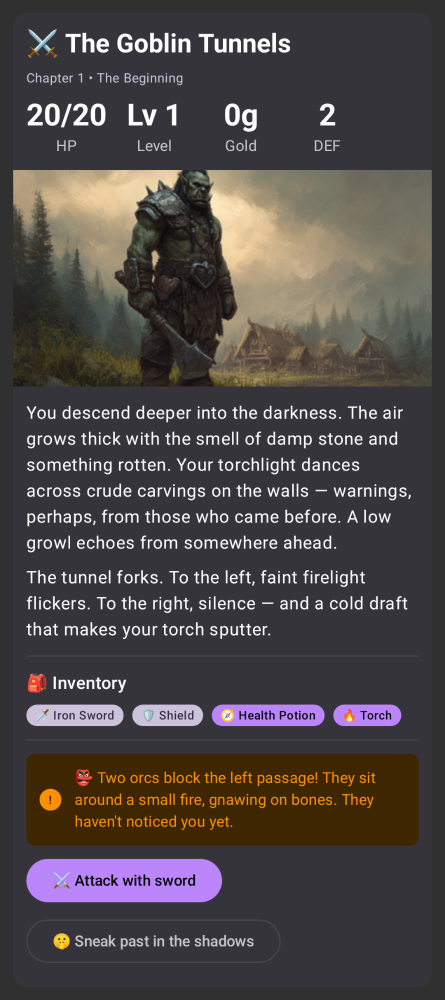 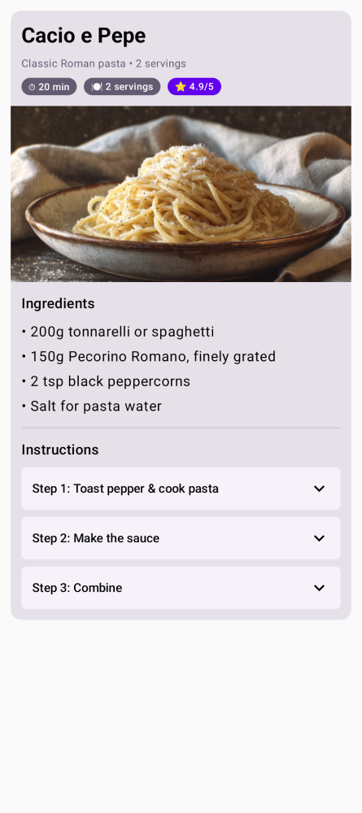 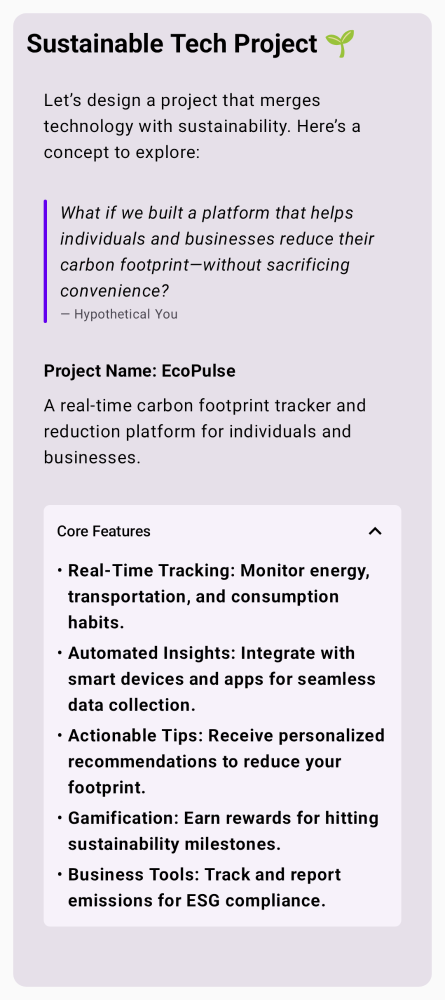 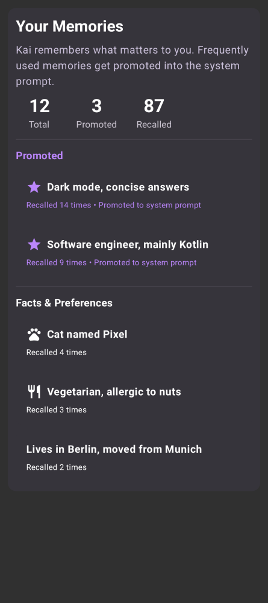

## Features

- **Persistent memory** — Kai remembers important details across conversations and uses them automatically
- **Customizable soul** — Define the AI's personality and behavior with an editable system prompt
- **Multi-service fallback** — 24 LLM providers with automatic failover
- **On-device inference** — Run AI models locally using LiteRT, no internet needed
- **Tool execution** — Web search, notifications, calendar events, shell commands, and more
- **MCP server support** — Connect to remote tool servers via the Model Context Protocol
- **Autonomous heartbeat** — Periodic self-checks that surface anything needing attention
- **Settings export/import** — Backup and restore all settings as a JSON file
- **Encrypted storage** — Conversations stored locally with encryption
- **Text to speech** — Listen to AI responses
- **Linux Sandbox** — On Android, the AI can run shell commands, scripts, and tools in a secure sandboxed Linux environment
- **Image attachments** — Attach images to any conversation

## Linux Sandbox (Android)

On Android, Kai includes a built-in Linux environment that the AI can use to execute shell commands, run scripts, and operate tools on your behalf. This turns Kai from a chat-only assistant into one that can take real action — installing packages, processing data, running Python scripts, and more.

- **Powered by Alpine Linux** — A lightweight ~3 MB download sets up a full Linux userland via [proot](https://proot-me.github.io/), no root required
- **Optional packages** — One tap installs bash, curl, wget, git, jq, python3, pip, and Node.js
- **Interactive terminal** — A built-in terminal lets you run commands manually alongside the AI
- **Secure** — Everything runs sandboxed inside the app with no access to the host system

Enable it in **Settings > Linux Sandbox**.

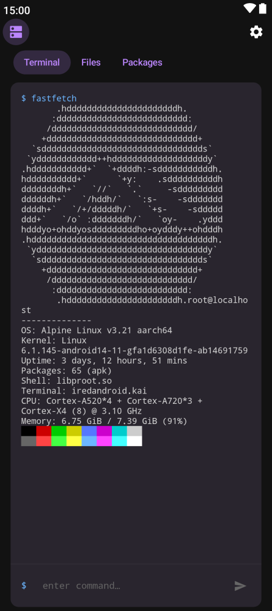

## Screenshots

### Mobile

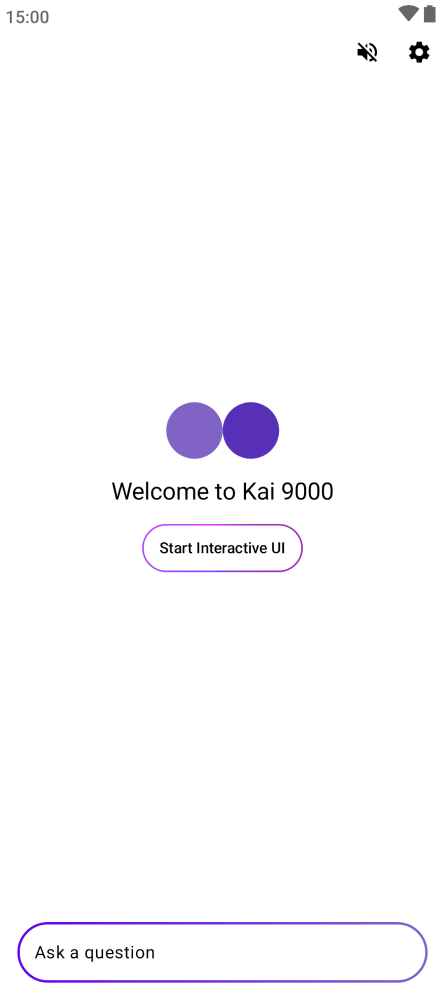 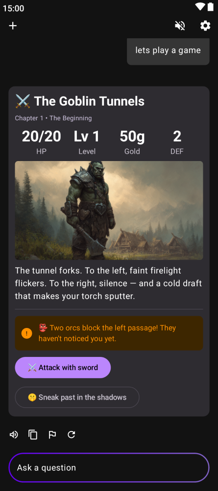 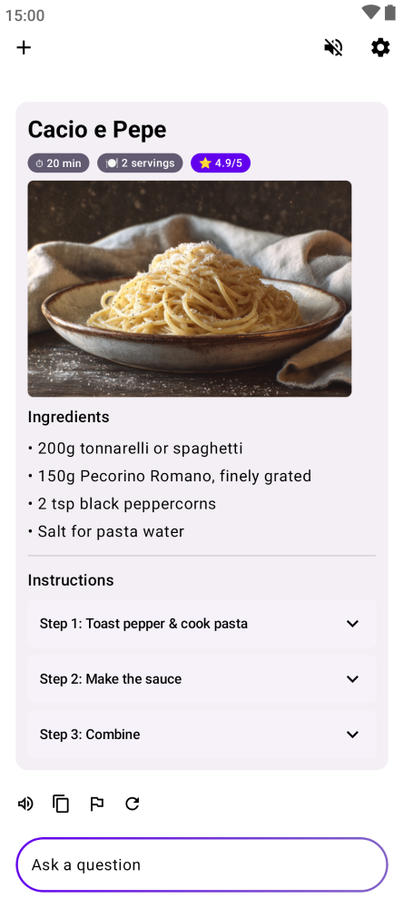 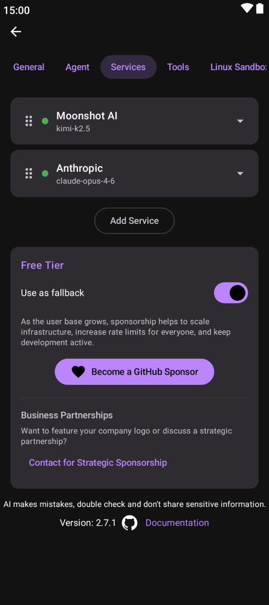 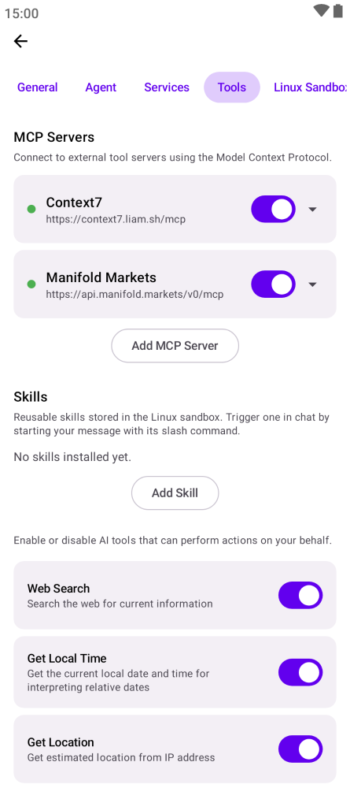 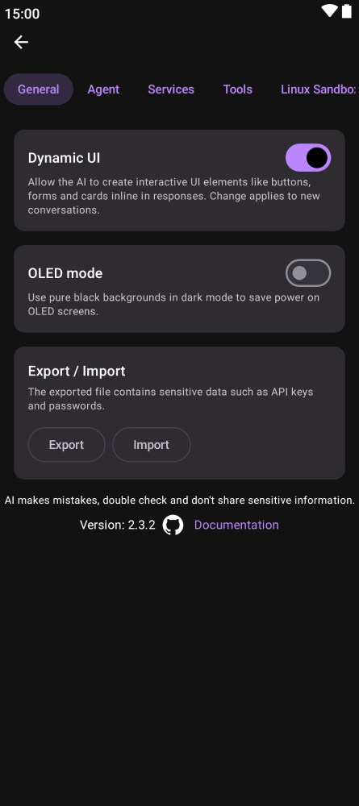

## How It Works

```
                        ┌────────┐
                        │  User  │
                        └───┬────┘
                            │ message
                            ▼
               ┌─────────────────────────┐
               │          Chat           │
               │                         │
               │  prompt + memories      │
               │        │                │
               │        ▼                │
               │    ┌────────┐           │
               │    │   AI   │◀─┐        │
               │    └───┬────┘  │        │
               │        │   tool calls   │
               │        │   & results    │
               │        ▼      │        │
               │    ┌────────┐ │        │
               │    │ Tools  │─┘        │
               │    └───┬────┘          │
               │        │               │
               └────────┼───────────────┘
                        │ store / recall
                        ▼
               ┌─────────────────┐    hitCount >= 5
               │     Memory      │───────────────────┐
               │                 │                   │
               │  facts, prefs,  │                   ▼
               │  learnings      │          ┌────────────────┐
               │                 │◀─delete──│ Promote into   │
               └─────────────────┘          │ System Prompt  │
                        ▲                   └────────────────┘
                        │ reviews
                        │
               ┌─────────────────┐
               │    Heartbeat    │
               │                 │
               │  autonomous     │
               │  self-check     │
               │  every 30 min   │
               │  (8am–10pm)     │
               │                 │
               │  all good?      │
               │  → stays silent │
               │  needs action?  │
               │  → notifies user│
               └─────────────────┘
```

- **Chat** — User sends a message. The AI responds, calling tools (memory, web search, shell, etc.) in a loop until it has a final answer.
- **Memory** — The AI stores and recalls facts, preferences, and learnings. Memories that prove useful (5+ hits) can be promoted into the system prompt permanently.
- **Heartbeat** — A background self-check runs every 30 minutes. It reviews memories, pending tasks, and emails. If something needs attention, it notifies the user. Otherwise, it stays silent.

## Supported Services

[Anthropic](https://console.anthropic.com) · [OpenAI](https://openai.com) · [Gemini](https://aistudio.google.com) · [DeepSeek](https://www.deepseek.com) · [Mistral](https://mistral.ai) · [xAI](https://x.ai) · [OpenRouter](https://openrouter.ai) · [Groq](https://groq.com) · [NVIDIA](https://developer.nvidia.com) · [Cerebras](https://cerebras.ai) · [Ollama Cloud](https://ollama.com) · [LongCat](https://longcat.chat) · [Together AI](https://together.ai) · [Hugging Face](https://huggingface.co) · [Venice AI](https://venice.ai) · [Moonshot AI](https://moonshot.cn) · [Z.AI](https://z.ai) · [MiniMax](https://minimax.io) · [AIHubMix](https://aihubmix.com) · [Deep Infra](https://deepinfra.com) · [Fireworks AI](https://fireworks.ai) · [OpenCode](https://opencode.ai) · OpenAI-Compatible API · LiteRT On-Device (Android) · Free tier (no API key needed)

## MCP Servers

Kai supports the [Model Context Protocol](https://modelcontextprotocol.io/) for connecting to external tool servers. Go to **Settings > Tools > Add MCP Server** to connect to any Streamable HTTP MCP endpoint, or pick from a curated list of popular free servers:

| Server | Description |
|--------|-------------|
| Fetch | Fetch web content and convert HTML to markdown |
| DeepWiki | AI-powered docs for any GitHub repo |
| Sequential Thinking | Structured step-by-step problem-solving |
| Context7 | Up-to-date library and framework docs |
| Globalping | Ping, traceroute, DNS from global probes |
| CoinGecko | Real-time crypto prices and market data |
| Manifold Markets | Prediction market data and odds |
| Find-A-Domain | Domain availability across 1,444+ TLDs |

All popular servers are free and require no API key. MCP servers auto-reconnect on app startup.

## Integrations

### Splinterlands Auto-Battle (Android)

Kai can automatically play [Splinterlands](https://splinterlands.com) Wild Ranked battles. Configure one or more LLM services in priority order, add your Hive account, and hit Start -- Kai will continuously find matches, pick teams using LLM-powered strategy, and submit them on-chain. Falls back to a simple greedy picker if all LLM services fail. Available in **Settings > Integrations**.

## Supported Languages

Afrikaans, Albanian, Amharic, Arabic, Belarusian, Bengali, Bulgarian, Chinese (Simplified), Chinese (Traditional), Croatian, Czech, Danish, Dutch, English, Estonian, Filipino, Finnish, French, German, Greek, Gujarati, Hebrew, Hindi, Hungarian, Indonesian, Italian, Japanese, Kazakh, Korean, Latvian, Lithuanian, Malay, Marathi, Norwegian, Persian, Polish, Portuguese, Punjabi, Romanian, Romansh, Russian, Serbian, Slovak, Slovenian, Spanish, Swahili, Swedish, Tamil, Telugu, Thai, Turkish, Ukrainian, Urdu, Vietnamese, Zulu

## Contributing

### Screenshot Automation

Two separate screenshot pipelines exist, both using Compose screenshot tests:

**README screenshots** — Used for this README. CI runs this automatically on every push and auto-commits any changes.

```bash
./gradlew :screenshotTests:updateScreenshots
```

**Store screenshots** — Generates localized screenshots for the Play Store in all supported locales. Upload via fastlane.

```bash
./gradlew :screenshotTests:generateStoreScreenshots
bundle exec fastlane android upload_screenshots
```

**Kai UI component screenshots** — Records golden images for `KaiUiScreenshotTest` only. Faster than recording the full suite when iterating on Kai UI components.

```bash
./gradlew :screenshotTests:recordKaiUiScreenshots
```

## Sponsors

This project is open-source and maintained by a single developer. If you find this app useful, please consider sponsoring to help take it to the next level with more features and faster updates.

## Credits

- Mistral: https://mistral.ai/
